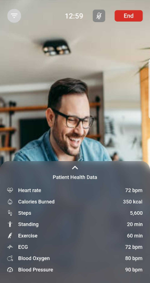

# Flash Health Telemedicine 

In this application I have used Flutter for mobile app development and Node.js (Nest js) as server side back-end api development.

## Some Screenshots of this application's journey are shared here except for the code part due to company policy. This application is still under continuous development phase. 

#### Onboard page one

#### Onboard page two

#### Onboard page three

#### Phone number submit page

#### OTP verification page

#### Sign Up page

#### Password Setup page

#### Doctors Appointment list page

#### Incoming Call recieve page

#### Call Screen 

#### Patient Health data checkup page

#### Medication page while checking up

#### Add medication page

#### See previous consultation detail page

#### Call detail & send prescription to patient page

